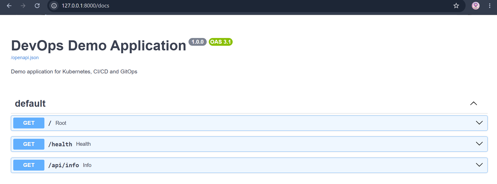
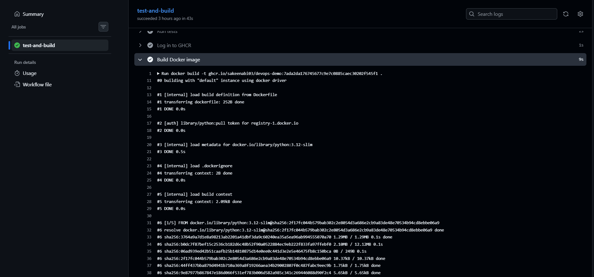
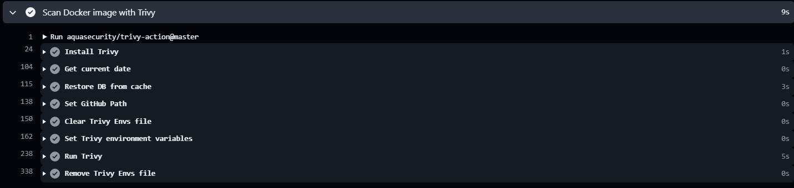

# Automated Kubernetes Deployment Platform Using Terraform & GitOps

> **Application and CI/CD repository** for the Automated Kubernetes Deployment Platform.

This repository contains the **FastAPI application**, **automated tests**, **Docker configuration**, **GitHub Actions CI/CD pipeline**, **Trivy security scanning**, **GitHub Container Registry (GHCR) image publishing**, **Kubernetes manifests**, and **Helm chart**.

It serves as the **application and CI/CD component** of the larger DevOps project. The application is developed, tested, containerized, security-scanned, and published from this repository, while deployment and infrastructure management are handled separately in the **[devops-gitops](https://github.com/sakeenabi03/devops-gitops)** repository using **Helm**, **Argo CD**, **Kubernetes**, **Terraform**, **Prometheus**, and **Grafana**.

## Related Repository

**GitOps & Infrastructure Repository:** [github.com/sakeenabi03/devops-gitops](https://github.com/sakeenabi03/devops-gitops)

The two repositories work together to implement the complete deployment platform:

```text
Automated Kubernetes Deployment Platform
                    │
        ┌───────────┴───────────┐
        │                       │
    devops-demo           devops-gitops
   Application + CI/CD    GitOps + Infrastructure
        │                       │
   FastAPI + Tests        Helm + Argo CD
   Docker + Trivy         Terraform + Kubernetes
   GitHub Actions         Prometheus + Grafana
   GHCR
```

### Repository Responsibilities

| Repository        | Responsibility                                                                                                          |
| ----------------- | ----------------------------------------------------------------------------------------------------------------------- |
| **devops-demo**   | FastAPI application, automated tests, Docker, GitHub Actions, Trivy, GHCR, Kubernetes manifests, and Helm chart         |
| **devops-gitops** | Helm deployment configuration, Argo CD GitOps, Terraform infrastructure, Kubernetes management, Prometheus, and Grafana |

````
````

---

## Table of Contents

* [Project Overview](#project-overview)
* [Architecture](#architecture)
* [Features](#features)
* [Technology Stack](#technology-stack)
* [Application API](#application-api)
* [Repository Structure](#repository-structure)
* [FastAPI Application](#fastapi-application)
* [Automated Testing](#automated-testing)
* [Docker](#docker)
* [Kubernetes Manifests](#kubernetes-manifests)
* [Helm Chart](#helm-chart)
* [GitHub Actions CI/CD](#github-actions-cicd)
* [Container Security with Trivy](#container-security-with-trivy)
* [GitHub Container Registry](#github-container-registry)
* [GitOps Integration](#gitops-integration)
* [Running the Application Locally](#running-the-application-locally)
* [Running with Docker](#running-with-docker)
* [Testing the API](#testing-the-api)
* [Project Validation](#project-validation)
* [Production Considerations](#production-considerations)
* [Related Repository](#related-repository)
* [Summary](#summary)

---

## Project Overview

The DevOps Demo Application is a lightweight REST API built using **FastAPI** and Python.

The project was created to demonstrate a complete application delivery workflow:

```text
Application Code
       ↓
   Automated Tests
       ↓
   Docker Build
       ↓
  Trivy Security Scan
       ↓
   GHCR Image Push
       ↓
   GitOps Repository
       ↓
 Kubernetes Deployment
```

The repository focuses on the **application development and CI/CD portion** of the platform.

The deployment and infrastructure components are maintained in the separate `devops-gitops` repository.

---

## Architecture

```text
                    Developer
                       │
                       ▼
                 GitHub Repository
                   devops-demo
                       │
                       ▼
                GitHub Actions
                       │
          ┌────────────┼────────────┐
          ▼            ▼            ▼
       Pytest       Docker       Trivy
          │            │            │
          └────────────┼────────────┘
                       ▼
              GitHub Container
                 Registry
                   GHCR
                       │
                       ▼
               GitOps Repository
                devops-gitops
                       │
                       ▼
                    Argo CD
                       │
                       ▼
                  Kubernetes
                  / Kind Cluster
```

---

## Features

* FastAPI REST API
* Health check endpoint
* Application information endpoint
* Automated API testing with **pytest**
* Docker containerization
* Kubernetes deployment manifests
* Helm chart
* GitHub Actions CI/CD pipeline
* Docker image vulnerability scanning with **Trivy**
* Docker image publishing to **GitHub Container Registry (GHCR)**
* Immutable Docker image tagging using the Git commit SHA
* Integration with a GitOps-based Kubernetes deployment workflow

---

## Technology Stack

| Category             | Technology                       |
| -------------------- | -------------------------------- |
| Programming Language | Python                           |
| Web Framework        | FastAPI                          |
| Application Server   | Uvicorn                          |
| Testing              | Pytest                           |
| Containerization     | Docker                           |
| CI/CD                | GitHub Actions                   |
| Container Security   | Trivy                            |
| Container Registry   | GitHub Container Registry (GHCR) |
| Orchestration        | Kubernetes                       |
| Packaging            | Helm                             |
| GitOps               | Argo CD                          |
| Local Kubernetes     | Kind                             |

---

# Application API

The application currently exposes three endpoints.

## Root Endpoint

```text
GET /
```

Example response:

```json
{
  "message": "DevOps Demo Application",
  "status": "running"
}
```

---

## Health Endpoint

```text
GET /health
```

Example response:

```json
{
  "status": "healthy"
}
```

This endpoint is also used by Kubernetes readiness and liveness probes.

### Application Health Check



---

## Application Information Endpoint

```text
GET /api/info
```

Example response:

```json
{
  "application": "devops-demo",
  "version": "1.0.0",
  "environment": "local"
}
```

---

## Swagger API Documentation

FastAPI automatically provides interactive API documentation.

When running locally, it can be accessed at:

```text
http://localhost:8000/docs
```

The Swagger interface can be used to test the available API endpoints.

---

# Repository Structure

```text
devops-demo/
│
├── app/
│   └── main.py
│
├── tests/
│   └── test_main.py
│
├── k8s/
│   ├── deployment.yaml
│   └── service.yaml
│
├── helm/
│   └── devops-demo/
│       ├── Chart.yaml
│       ├── values.yaml
│       └── templates/
│           ├── deployment.yaml
│           └── service.yaml
│
├── .github/
│   └── workflows/
│       └── ci.yml
│
├── images/
│   ├── github-actions.png
│   ├── trivy-scan.png
│   └── application-health.png
│
├── Dockerfile
├── requirements.txt
├── .gitignore
└── README.md
```

---

# FastAPI Application

The application is implemented in:

```text
app/main.py
```

The FastAPI application provides:

* REST API endpoints
* Application health checking
* Application metadata
* Kubernetes-compatible health endpoints

The application is configured with:

```python
app = FastAPI(
    title="DevOps Demo Application",
    description="Demo application for Kubernetes, CI/CD and GitOps",
    version="1.0.0"
)
```

---

# Automated Testing

Automated tests are located in:

```text
tests/test_main.py
```

The project uses **pytest** to validate the application endpoints.

The test suite verifies:

* Root endpoint
* Health endpoint
* Application information endpoint

Run the tests locally using:

```bash
pytest
```

Expected result:

```text
3 passed
```

Automated tests are also executed as part of the GitHub Actions pipeline before the Docker image is published.

---

# Docker

The application is containerized using Docker.

The Docker configuration is defined in:

```text
Dockerfile
```

The image uses:

```dockerfile
FROM python:3.12-slim
```

The container:

1. Uses Python 3.12
2. Installs the application dependencies
3. Copies the FastAPI application
4. Exposes port `8000`
5. Starts the application using Uvicorn

The application listens on:

```text
0.0.0.0:8000
```

---

# Kubernetes Manifests

Basic Kubernetes deployment manifests are maintained under:

```text
k8s/
```

The directory contains:

```text
k8s/
├── deployment.yaml
└── service.yaml
```

The Kubernetes Deployment defines the application workload, while the Service provides internal Kubernetes networking.

The application also uses the `/health` endpoint for Kubernetes health checks.

---

# Helm Chart

The repository also contains a Helm chart:

```text
helm/devops-demo/
```

The chart contains:

```text
helm/devops-demo/
├── Chart.yaml
├── values.yaml
└── templates/
    ├── deployment.yaml
    └── service.yaml
```

Helm is used to package and parameterize the Kubernetes deployment.

The chart supports configuration such as:

* Replica count
* Container image
* Image tag
* Image pull policy
* Service type
* Service port
* Container port

Example:

```yaml
replicaCount: 2

image:
  repository: devops-demo
  tag: "1.0"
  pullPolicy: IfNotPresent
```

The Helm chart is also used by the GitOps repository for Kubernetes deployment.

---

# GitHub Actions CI/CD

The CI/CD workflow is defined in:

```text
.github/workflows/ci.yml
```

The workflow is triggered when changes are pushed to the `main` branch or when a pull request targets `main`.

The pipeline performs the following steps:

```text
Checkout Source Code
        ↓
Set Up Python
        ↓
Install Dependencies
        ↓
Run Pytest
        ↓
Login to GHCR
        ↓
Build Docker Image
        ↓
Trivy Security Scan
        ↓
Push Image to GHCR
```

## CI/CD Pipeline



The pipeline provides automated validation before the container image is published.

### Pipeline Steps

### 1. Checkout

GitHub Actions checks out the application source code.

### 2. Python Setup

The workflow configures Python 3.12.

### 3. Dependency Installation

The dependencies defined in `requirements.txt` are installed.

### 4. Automated Tests

The test suite is executed using:

```bash
pytest
```

### 5. Docker Image Build

The application is packaged into a Docker image.

### 6. Container Security Scan

The Docker image is scanned using Trivy.

### 7. GHCR Push

After the validation and security scan, the Docker image is pushed to GitHub Container Registry.

---

# Container Security with Trivy

The CI pipeline integrates **Trivy** to scan the built Docker image for known vulnerabilities.

The workflow checks for:

```text
HIGH
CRITICAL
```

severity vulnerabilities.

The configuration uses:

```yaml
exit-code: 1
ignore-unfixed: true
severity: CRITICAL,HIGH
```

This allows the CI pipeline to fail when applicable HIGH or CRITICAL vulnerabilities are detected.

## Trivy Security Scan



This security gate helps prevent an image with known serious vulnerabilities from being published to the container registry.

---

# GitHub Container Registry

The project publishes validated Docker images to **GitHub Container Registry (GHCR)**.

The image follows the naming pattern:

```text
ghcr.io/<github-username>/devops-demo:<commit-sha>
```

For example:

```text
ghcr.io/example-user/devops-demo:a1b2c3d4...
```

The actual image name in the repository is based on the GitHub repository owner.

---

## Immutable Image Tagging

The CI pipeline uses the Git commit SHA as the Docker image tag:

```text
${{ github.sha }}
```

This provides a unique image version for each commit.

For example:

```text
devops-demo:abc123...
```

This approach avoids relying only on mutable tags such as:

```text
latest
```

and allows the GitOps repository to reference a specific image version.

---

# GitOps Integration

This repository is responsible for building and publishing the application image.

The deployment configuration is maintained separately in:

```text
devops-gitops
```

The overall flow is:

```text
Developer pushes code
        ↓
devops-demo
        ↓
GitHub Actions
        ↓
Tests
        ↓
Docker Build
        ↓
Trivy Scan
        ↓
GHCR
        ↓
devops-gitops
        ↓
Argo CD
        ↓
Kubernetes
```

The GitOps repository contains the Helm deployment configuration and references the published GHCR image.

Argo CD then synchronizes the desired state from Git into the Kubernetes cluster.

This separation keeps:

* Application source code
* CI/CD configuration
* Deployment configuration
* Infrastructure configuration

organized into their respective responsibilities.

---

# Running the Application Locally

## Prerequisites

Install the following:

* Python 3.12
* Git
* Docker (optional for container execution)

---

## Clone the Repository

```bash
git clone <your-repository-url>
cd devops-demo
```

---

## Create a Virtual Environment

Windows:

```cmd
python -m venv venv
```

Activate it:

```cmd
venv\Scripts\activate
```

---

## Install Dependencies

```bash
pip install -r requirements.txt
```

---

## Start the Application

```bash
uvicorn app.main:app --reload
```

The application will be available at:

```text
http://localhost:8000
```

---

# Running with Docker

## Build the Image

From the repository root:

```bash
docker build -t devops-demo:local .
```

---

## Run the Container

```bash
docker run -p 8000:8000 devops-demo:local
```

The application will be available at:

```text
http://localhost:8000
```

---

## Verify the Container

```bash
docker ps
```

The running container should expose port:

```text
8000
```

---

# Testing the API

Once the application is running, test the health endpoint:

```text
http://localhost:8000/health
```

Expected response:

```json
{
  "status": "healthy"
}
```

You can also access the Swagger documentation:

```text
http://localhost:8000/docs
```

---

# Project Validation

The project can be validated at multiple stages.

## Application Validation

```bash
pytest
```

Expected:

```text
3 passed
```

## Docker Validation

```bash
docker build -t devops-demo:local .
```

Then:

```bash
docker run -p 8000:8000 devops-demo:local
```

## CI/CD Validation

The GitHub Actions workflow validates:

* Dependency installation
* Automated tests
* Docker image build
* Trivy security scan
* GHCR image publishing

## Kubernetes Validation

The deployment can be verified using:

```bash
kubectl get pods
kubectl get deployments
kubectl get services
```

## GitOps Validation

Argo CD monitors the deployment configuration stored in the `devops-gitops` repository and synchronizes the Helm release to Kubernetes.

---

# Production Considerations

This project is designed as a portfolio and learning project using a local Kubernetes environment.

For a production deployment, additional components and controls could include:

* AWS EKS or another managed Kubernetes platform
* Managed container registry
* External secrets management
* TLS/HTTPS
* Ingress controller
* Network policies
* Resource quotas
* Horizontal Pod Autoscaling
* Centralized logging
* Advanced alerting
* Production-grade monitoring
* Remote Terraform state
* Infrastructure approval workflows
* Environment-specific configurations

These are intentionally outside the current local implementation.

---

# Related Repository

The deployment and infrastructure configuration for this application is maintained in the companion repository:

**devops-gitops**

It contains:

* Helm deployment configuration
* Argo CD GitOps configuration
* Terraform infrastructure configuration
* Kubernetes deployment workflow
* Prometheus
* Grafana
* Monitoring configuration

The two repositories together form the complete DevOps platform.

---

# Summary

This repository demonstrates a complete application-focused CI/CD workflow using:

```text
Python
  ↓
FastAPI
  ↓
Pytest
  ↓
Docker
  ↓
GitHub Actions
  ↓
Trivy
  ↓
GHCR
  ↓
GitOps
  ↓
Kubernetes
```

The project demonstrates practical implementation of:

* REST API development
* Automated testing
* Containerization
* CI/CD automation
* Container security
* Container registry management
* Kubernetes deployment
* Helm packaging
* GitOps-based deployment

The companion `devops-gitops` repository extends this workflow with **Terraform, Argo CD, Kubernetes, Helm, Prometheus, and Grafana** to provide the infrastructure and deployment layer.
